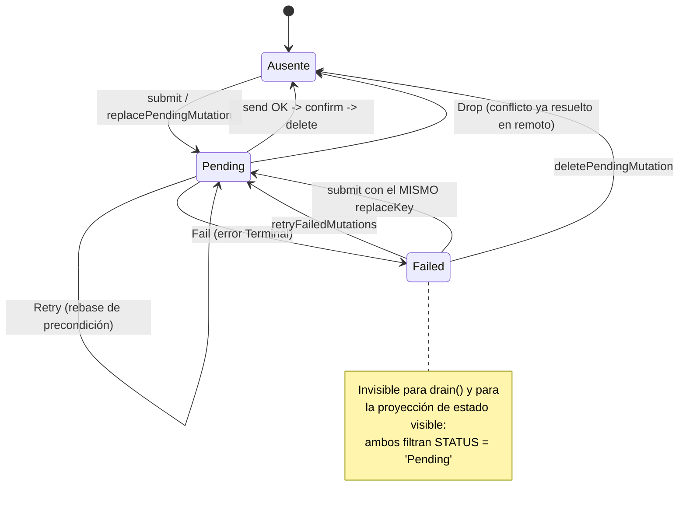
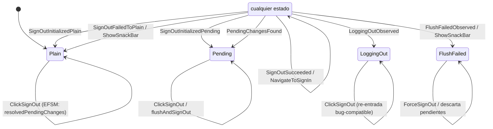
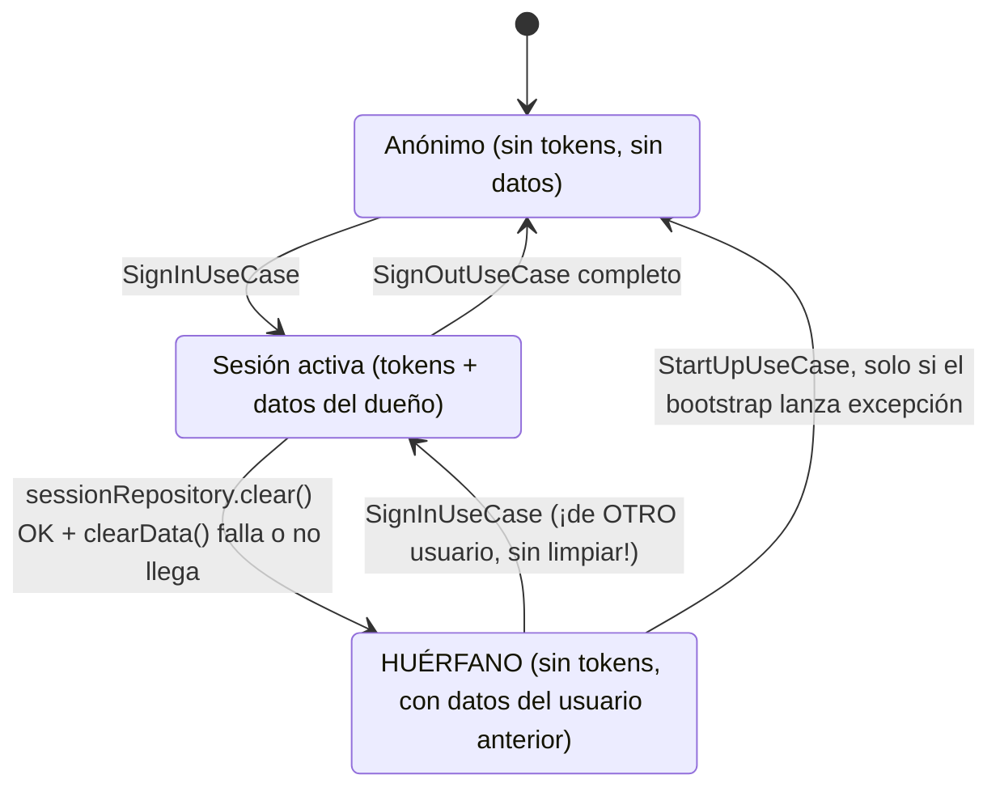

# Análisis sistémico — Outbox de sincronización y ciclo de sesión

> Alcance elegido: `persistence/domain/mutation`, la proyección de estado visible de
> `evaluations` y `record`, el ciclo de sesión de `auth` + `maincore`, y el motor de
> máquinas de estado de `base` como componente transversal.
>
> El repositorio tiene 16 módulos. Se usó `graphify-out/graph.json` (`graphify query`)
> para elegir qué módulos abrir, y se acotó al subsistema con más estado: el que
> mantiene cambios del usuario fuera de línea y decide qué se ve y qué se envía. Todo
> hallazgo cita código leído directamente.

## Resumen ejecutivo

Se modelaron cuatro sistemas y tres máquinas conceptuales: el sobre de mutación
(`MutationEnvelope`, explícita), el cierre de sesión (`SignOut`, explícita) y la
sesión local (implícita, formada por el par *tokens × datos locales*). El motor de
presentación está formalizado con un rigor poco común —tabla introspectable,
objetivo declarado verificado en runtime, alfabeto y Λ validados en tests— y no es la
fuente de los problemas. Los problemas están una capa más abajo: el **outbox tiene un
estado, `Failed`, que ningún operador de proyección visible sabe leer**, y la
**invariante "los datos locales pertenecen al usuario con sesión activa" no está
sostenida por ningún operador atómico**.

Resultado: 2 hallazgos `critical`, 3 `high`, 3 `medium`, 3 `low`. El más grave es la
ruptura de la invariante de propiedad de los datos locales: `SessionRecoveryDataSource`
borra la sesión y luego intenta borrar los datos dentro de un `runCatching` que
descarta el fallo, y ni `StartUpUseCase` ni `SignInUseCase` reparan el estado
resultante — el siguiente usuario que inicie sesión en ese dispositivo hereda el
expediente académico y el outbox del anterior, y ese outbox se enviará con sus
credenciales.

## Sistemas identificados

| Sistema | Objetivo | Elementos | Operadores |
|---|---|---|---|
| **Motor de mutaciones** (`persistence/domain/mutation`) | Llevar todo cambio local del usuario hasta el servidor exactamente una vez, o dejarlo declarado como pendiente | `MutationEnvelope`, `MutationPrecondition`, `PendingMutationStatus`, `MutationFailureResolution` | `submit`, `submitInBackground`, `drain`, `deletePendingMutation`, `beginMutation`, `rememberMutationVersion`, `processExecution` (`send`/`confirm`/`resolveFailure`) |
| **Proyección de estado visible** (`evaluations`, `record`) | Mostrar al usuario el resultado de sus cambios antes de que el servidor los confirme | `LocalEvaluation`, `LocalEvaluationsSnapshot`, `AcademicRecord`, `AttemptOverride` | `resolveVisibleState`, `reapplyingPendingMutations`, `saveConfirmedSnapshot`, `confirmAdded/Updated/RemovedEvaluation`, `removeConfirmedEvaluation` |
| **Ciclo de sesión** (`auth`, `maincore`) | Garantizar que los datos locales y las credenciales activas describan a la misma persona | `SessionSnapshot`, `PendingChanges`, `SyncStatus` | `SignInUseCase`, `SignOutUseCase`, `invalidateSession`, `flushPendingChanges`, `retryFailedMutations`, `clearData` |
| **Motor de máquinas de estado** (`base/presentation/statemachine`) | Hacer de cada transición de pantalla una entidad enumerable, con destino declarado y salidas declaradas | `TransitionSpec`, `MachineDefinition`, `ViewState`/`ViewAction`/`ViewEffect` | `define`/`build`, `resolve`, `apply`, `process`, `sendEffect`, `processInternalEvent`, `launchMachineJob` |

Nota sobre el cuarto sistema: es el que la doctrina del repo (`docs/spike-kstatemachine-signin.md`)
ya describe como una 6-tupla M = (S, S₀, Σ, Λ, T, G). Se verificó y se reporta un solo
hallazgo estructural sobre él ([M-7](#medium-risk-build-valida-duplicados-por-igualdad-de-clase-y-resolve-empareja-por-subtipo)).
El desequilibrio es deliberado: la capa formalizada resistió la verificación, la capa de datos no.

## Máquinas conceptuales

### 1. El sobre de mutación (`MutationEnvelope`)

Estados declarados: `PendingMutationStatus.Pending`, `PendingMutationStatus.Failed`
(`base/domain/model/mutation/PendingMutationStatus.kt`). El tercer estado real es
**`Ausente`** — la ausencia de fila en la tabla `pending_mutation` — y es el estado
terminal de éxito. No está declarado en ningún lado: es implícito en el `DELETE`.



Matriz estado × operador (los **huecos** en negrita):

| Estado \ Operador | `submit` | `send`→`confirm` | `Defer` | `Drop` | `Fail` | `Retry` | `deletePendingMutation` | `retryFailedMutations` | `drain` | proyección visible |
|---|---|---|---|---|---|---|---|---|---|---|
| **Ausente** | → `Pending` | — | — | — | — | — | no-op | no-op | no lo ve (correcto) | no aporta (correcto) |
| **Pending** | → `Pending` (reemplaza) | → `Ausente` | → `Pending` | → `Ausente` | → `Failed` | → `Pending` | → `Ausente` | no-op | lo ejecuta | **lo aplica** |
| **Failed** | → `Pending` (si mismo `replaceKey`) | — | — | — | — | — | → `Ausente` | → `Pending` | **HUECO: no lo ve** | **HUECO: no lo aplica** |

Los dos huecos de la fila `Failed` son los hallazgos [D-1](#critical-inconsistency-failed-está-fuera-del-dominio-del-operador-de-proyección-visible)
y [D-2](#high-risk-failed-es-absorbente-la-única-salida-práctica-es-intentar-cerrar-sesión).

Evidencia de los filtros:

```sql
-- persistence/.../daos/PendingMutationDao.kt:15 y :24
AND status = 'Pending'
```

`observePendingMutations` (fila 11-18) y `getPendingMutations` (fila 20-27) filtran
`Pending`; `getMutations` (fila 29-35) no filtra y es la única consulta que ve la
población completa — se usa solo para **contar** en `PendingChangesDataSource.kt:23-40`.

### 2. Cierre de sesión (`SignOut`)

La única máquina de pantalla que cruza la frontera hacia el sistema de sincronización.
La tabla es completa y honesta; se incluye porque es el único camino de salida de
`Failed`.



| Estado \ Acción | `Initialize` | `ClickSignOut` | `RetryFlushAndSignOut` | `ForceSignOut` |
|---|---|---|---|---|
| `Plain` | definida (`fromAny`) | definida | definida (`fromAny`) | rechazada + telemetría |
| `Pending` | definida (`fromAny`) | definida | definida (`fromAny`) | rechazada + telemetría |
| `FlushFailed` | definida (`fromAny`) | definida | definida (`fromAny`) | definida |
| `LoggingOut` | definida (`fromAny`) | definida | definida (`fromAny`) | rechazada + telemetría |

No hay huecos: las tres celdas `ForceSignOut` rechazadas corresponden a un botón que
solo existe en el diálogo de `FlushFailed`, y la política declarada del motor
(ignorar + `app_invalid_transition`) las cubre. Esta matriz es el contraejemplo útil
del informe: así se ve una máquina cerrada.

### 3. La sesión local (máquina implícita)

No existe ningún enum. El estado es el par *(¿hay tokens?, ¿hay datos locales?)*, y
esa combinación **sí es una máquina de estados** aunque nadie la declaró.



`Huérfano` es un estado que el sistema **puede representar y puede alcanzar, pero no
declara ni repara**. Es el hallazgo [S-1](#critical-inconsistency-la-invariante-los-datos-locales-pertenecen-al-usuario-con-sesión-activa-no-la-sostiene-ningún-operador).

## Hallazgos

### [critical] [INCONSISTENCY] La invariante "los datos locales pertenecen al usuario con sesión activa" no la sostiene ningún operador {#s-1}

- **Check**: 6 (invariantes y fallo parcial), 5 (estados ilegales representables)
- **Evidencia**:
  - `maincore/src/commonMain/.../session/SessionRecoveryDataSource.kt:88-94`:
    ```kotlin
    override suspend fun invalidateSession(sessionId: String?) {
        sessionCoroutineScope.cancelActiveWork()
        runCatching { sessionRepository.clear() }
        runCatching { syncStatusRepository.reset() }
        runCatching { applicationRepository.clearData() }
        ...
    }
    ```
    Cuatro escrituras independientes, sin transacción ni marca de reanudación, y el
    borrado de datos va **envuelto en `runCatching`**: si falla, el fallo se descarta.
  - `auth/src/commonMain/.../usecase/SignOutUseCase.kt:65-68`: la misma secuencia sin
    `runCatching`, pero igual de no atómica — `sessionRepository.clear()` precede a
    `applicationRepository.clearData()`.
  - `app/src/main/.../AndroidApplicationDataSource.kt:42-58`: `clearData()` borra la
    base, invalida claves y hace `deleteRecursively` sobre cuatro directorios. Es una
    operación larga y con E/S real: puede fallar y puede ser interrumpida.
  - `maincore/src/commonMain/.../usecase/StartUpUseCase.kt:48-70`: el arranque solo
    limpia dentro de `.onFailure`, es decir **cuando el bootstrap lanza excepción**.
    Sin sesión no hay excepción: `hasActiveSession()` devuelve `false`, el resultado
    es `StartUpTarget.Auth` y los datos quedan intactos.
  - `auth/src/commonMain/.../usecase/SignInUseCase.kt:39-100`: el inicio de sesión no
    llama a `clearData()` ni compara ninguna identidad contra los datos existentes.
  - No existe columna de propietario en el esquema: `PendingMutationEntity.kt:31-59`
    tiene `storeId`, `scopeKey`, `entityType`, `entityId` — ningún identificador de
    usuario. `EVALUATIONS_MUTATION_SCOPE = "evaluations"` es una constante global
    (`EvaluationMutation.kt:10`).
- **Diagnóstico sistémico**: el sistema *sesión local* tiene un invariante no escrito
  —el par (tokens, datos) describe a una sola persona— cuyo mantenimiento se delega a
  un operador compuesto que no es atómico y cuyo fallo se silencia. El resultado es un
  **estado ilegal representable**: `Huérfano`. Y como el sistema de persistencia no
  modela la propiedad (no hay elemento "dueño"), ningún operador posterior puede
  detectar la inconsistencia: `SignInUseCase` no tiene con qué comparar. Es el patrón
  clásico de fallo parcial sin compensación, agravado porque el estado corrupto **no
  es distinguible del estado sano**.
- **Escenario concreto**: en un dispositivo compartido (laboratorio, familia, cuenta de
  revisión), el usuario A cierra sesión o su sesión es invalidada; `clearData()` falla
  por E/S o el proceso muere durante los `deleteRecursively`. El usuario B inicia
  sesión: ve el expediente académico y las evaluaciones de A, y el outbox de A se
  drena con las credenciales de B en el siguiente `flushPendingChanges` o
  `updateEvaluations`, escribiendo los cambios de A en la cuenta de B.
- **Recomendación**: (1) invertir el orden — borrar datos **antes** que la sesión, de
  modo que una interrupción deje `Activa` (recuperable) en vez de `Huérfano`; (2)
  persistir una marca `teardownPending(sessionId)` fuera del ámbito borrado y
  reintentar el borrado al arrancar; (3) modelar la propiedad como componente:
  guardar el `usbId` dueño de la base y verificarlo en `SignInUseCase`, limpiando si
  no coincide. La opción (3) es la única que también cubre reinstalaciones y
  restauraciones de backup.

### [critical] [INCONSISTENCY] `Failed` está fuera del dominio del operador de proyección visible {#d-1}

- **Check**: 1 (clausura)
- **Evidencia**:
  - `persistence/.../daos/PendingMutationDao.kt:11-27`: `observePendingMutations` y
    `getPendingMutations` filtran `AND status = 'Pending'`.
  - `evaluations/.../source/RoomDatabaseDataSource.kt:54-68`: el estado visible se
    construye combinando el snapshot confirmado con `mutationEngine.observePendingMutations(...)`:
    ```kotlin
    return combine(observeConfirmedSnapshotFlow(), pendingFlow) { confirmedSnapshot, pendingMutations ->
        confirmedSnapshot.copy(
            evaluations = visibleEvaluationsStateResolver.resolveVisibleState(...)
        )
    }
    ```
  - `evaluations/.../resolver/VisibleEvaluationsStateResolver.kt:16-56`: el `when`
    sobre el comando solo se ejecuta para las mutaciones que recibe — es decir, solo
    `Pending`.
  - `record/.../source/AcademicRecordDataSource.kt:217-223` y `240-243`:
    `persistRemoteSnapshot` reaplica `currentPendingMutations()`, que también es
    `getPendingMutations` (solo `Pending`).
  - `persistence/.../StoreBackedMutationEngine.kt:326-333`: la resolución `Fail`
    escribe `status = PendingMutationStatus.Failed` y **conserva la fila**.
- **Diagnóstico sistémico**: violación de clausura, en la forma canónica `1/2 = 0.5`.
  Dos elementos legítimos (un sobre en `Failed` y un snapshot confirmado) y un
  operador legítimo (la proyección visible) producen un resultado que el sistema
  visible **no tiene forma de representar**: el cambio del usuario existe, está
  guardado, el sistema sabe que existe (`getPendingChanges` lo cuenta y expone
  `hasFailedMutations`, `PendingChangesDataSource.kt:34-39`) y aun así no aparece en
  ninguna parte de la interfaz. El operador de proyección está definido sobre
  `{Pending}` cuando el alfabeto de estados es `{Pending, Failed}`.
- **Escenario concreto**: el usuario crea una evaluación; el envío falla con un error
  clasificado como `Terminal` (`EvaluationMutationSyncSpec.kt:156-157` — cualquier
  error que no sea conflicto, precondición o 404, p. ej. un 500 o un fallo de
  serialización). El sobre pasa a `Failed`. Como en `evaluations` no hay escritura
  local optimista (`EvaluationDataSource.kt:112-133` solo construye y envía; la
  escritura ocurre en `confirm`), **la evaluación desaparece de la pantalla sin aviso**.
- **Nota**: en `record` el mismo estado produce un síntoma distinto y también
  incorrecto — ver [D-4](#medium-ambiguity-dos-estrategias-optimistas-incompatibles-sobre-el-mismo-motor).
- **Recomendación**: dar a la proyección el alfabeto completo. Concretamente, separar
  dos ejes hoy fundidos en `status`: *elegibilidad de envío* (`Pending` / `Failed`) y
  *visibilidad* (siempre visible mientras la fila exista). La consulta que alimenta la
  proyección debe leer ambos estados y marcar los `Failed` en la UI; la que alimenta
  `drain` puede seguir filtrando.

### [high] [RISK] `Failed` es absorbente: la única salida práctica es intentar cerrar sesión {#d-2}

- **Check**: 4 (alcanzabilidad — estado absorbente no terminal), 9 (simetría)
- **Evidencia**:
  - Único operador que sale de `Failed`: `PendingMutationDao.kt:68-82`
    (`retryFailedMutations`, `WHERE ... AND status = 'Failed'`).
  - Su único llamador: `maincore/.../pending/PendingChangesDataSource.kt:52-67, 81-90`,
    dentro de `flushPendingChanges()`.
  - El único llamador de `flushPendingChanges()`:
    `auth/.../usecase/FlushPendingChangesUseCase.kt:14-16`, cuyo único consumidor es
    `auth/.../machine/SignOutMachine.kt:90-92` (`flushAndSignOut`).
  - Los refrescos normales **no** rescatan: `EvaluationDataSource.kt:86-90` y
    `AcademicRecordDataSource.kt:86-90` llaman a `drain`, y
    `StoreBackedMutationEngine.kt:206-225` recorre `getPendingMutations(scopeKey)` —
    solo `Pending`.
- **Diagnóstico sistémico**: `Failed` es un estado no terminal sin transición de
  salida alcanzable desde el flujo normal de uso. El operador `Fail` (marcar) existe;
  su dual (desmarcar) existe pero está enterrado en una rama de control invertida: para
  reintentar un cambio hay que **iniciar el cierre de sesión**. Un recurso que se marca
  y solo se desmarca al salir del sistema es una fuga estructural del ciclo de vida.
- **Recomendación**: llamar a `retryFailedMutations` en el mismo punto donde ya se
  llama a `drain` (el pull-to-refresh de cada feature), y exponer una acción explícita
  de reintento en la UI una vez que los `Failed` sean visibles ([D-1](#critical-inconsistency-failed-está-fuera-del-dominio-del-operador-de-proyección-visible)).
  Con backoff, para no convertirlo en el bucle del check 12.

### [high] [RISK] Reintentar un `Add` fallido después de recrearlo duplica el elemento en el servidor {#d-3}

- **Check**: 7 (idempotencia y reentrada)
- **Evidencia**:
  - `evaluations/.../usecase/AddEvaluationUseCase.kt:23-24`: cada alta genera una
    referencia nueva — `reference = identifierRepository.generateRandomIdentifier()`.
  - `evaluations/.../mutation/EvaluationMutation.kt:30-33`: `replaceKey = "evaluation:$referenceId"`.
  - `persistence/.../RoomMutationEnvelopeStore.kt:63-79`: `replacePendingMutation`
    borra por `(storeId, replaceKey)` — **reemplaza solo si el `replaceKey` coincide**.
  - `evaluations/.../EvaluationMutationSyncSpec.kt:126-139`: la deduplicación del
    servidor se resuelve buscando `evaluation.referenceId == command.referenceId`.
- **Diagnóstico sistémico**: el operador `Add` no es idempotente respecto de la
  intención del usuario, solo respecto de su identificador técnico. La clave de
  reemplazo protege contra el doble envío del *mismo* sobre, pero no contra dos sobres
  que expresan el *mismo hecho de negocio*. Combinado con [D-1](#critical-inconsistency-failed-está-fuera-del-dominio-del-operador-de-proyección-visible),
  el sistema empuja activamente al usuario a producir el segundo sobre.
- **Escenario concreto**: (1) el usuario añade una evaluación; el `Add` falla con error
  `Terminal` y pasa a `Failed`; (2) por [D-1](#critical-inconsistency-failed-está-fuera-del-dominio-del-operador-de-proyección-visible)
  la evaluación desaparece de la pantalla; (3) el usuario la vuelve a crear — nueva
  `referenceId`, nuevo `replaceKey`, así que **el sobre viejo no se reemplaza**; (4)
  el segundo `Add` se confirma; (5) al cerrar sesión, `retryFailedMutations` devuelve
  el primer sobre a `Pending` y `drain` lo envía ordenado por `createdAt ASC`; (6) su
  `referenceId` no coincide con nada en el remoto, así que el servidor lo crea. El
  usuario termina con dos evaluaciones idénticas.
- **Recomendación**: derivar la clave de idempotencia del hecho de negocio (p. ej.
  `attemptId + tipo + fecha`) en vez de un UUID por invocación; o, como mitigación
  mínima, borrar los sobres `Failed` del mismo `entityType`/atributos al aceptar un
  alta equivalente.

### [high] [RISK] El guard de versión no cubre la ventana del fetch: el snapshot remoto puede pisar una mutación ya confirmada {#d-5}

- **Check**: 8 (concurrencia — lost update)
- **Evidencia**:
  - `evaluations/.../EvaluationDataSource.kt:77-83` (idéntico en
    `record/.../AcademicRecordDataSource.kt:78-84`):
    ```kotlin
    val snapshotVersion = mutationEngine.currentMutationVersion()
    val remoteSnapshot = evaluationsApiDataSource.getEvaluations()
    fetchedSnapshot = remoteSnapshot
    if (snapshotVersion == mutationEngine.currentMutationVersion()) {
        databaseDataSource.saveConfirmedSnapshot(remoteSnapshot.toLocalSnapshot())
        ...
    }
    ```
  - `persistence/.../StoreBackedMutationEngine.kt:149-159`: `latestMutationVersion`
    **solo avanza en `beginMutation`**, es decir al *crear* la mutación. Ni `confirm`
    ni la eliminación del sobre lo mueven.
  - `evaluations/.../RoomDatabaseDataSource.kt:227-241`: `persistConfirmedSnapshot`
    con `replaceAll = true` ejecuta `evaluationDao.deleteAll()` y vuelve a insertar.
  - Las mutaciones corren fuera del candado del refresco: `submitInBackground`
    (`StoreBackedMutationEngine.kt:189-204`) lanza en `coroutineScope`, y
    `withScopeExecutionLock` (`:399-410`) solo serializa ejecuciones entre sí —
    `updateEvaluations` no lo toma.
- **Diagnóstico sistémico**: el guard pretende expresar "no pisar si hubo cambios
  locales durante el fetch", pero el contador que usa mide *creación de mutaciones*,
  no *aplicación de cambios*. Es un caso de expresión mínima mal elegida: se eligió
  como testigo del cambio un componente que no cubre toda la ventana. El operador de
  escritura (`replaceAll = true`) es destructivo, así que el fallo no degrada: borra.
- **Escenario concreto**: el usuario edita una nota (versión pasa a *v*); el envío sale
  y el servidor lo aplica; mientras tanto arranca un refresco cuya respuesta se generó
  **antes** de esa escritura remota. Al volver, `currentMutationVersion()` sigue siendo
  *v* (nadie creó mutaciones nuevas), el guard pasa, `deleteAll()` + insert del
  snapshot viejo, y la edición ya confirmada desaparece de la pantalla hasta el
  siguiente refresco.
- **Recomendación**: hacer avanzar la versión también al confirmar y al eliminar un
  sobre (es el mismo `versionMutex`), o —más simple y más fuerte— ejecutar el
  `saveConfirmedSnapshot` dentro de `withScopeExecutionLock(scopeKey)`, que ya existe
  y ya serializa el resto de las escrituras del mismo ámbito.

### [medium] [AMBIGUITY] Dos estrategias optimistas incompatibles sobre el mismo motor {#d-4}

- **Check**: 2 (ambigüedad de operador), 10 (expresión mínima)
- **Evidencia**:
  - `record/.../AcademicRecordDataSource.kt:109-114` (y `:156`, `:174`, `:194`): el
    módulo **escribe la base local de inmediato** (`localDataSource.upsertAttemptOverride(...)`,
    `localDataSource.addSyntheticTerm(...)`) *y además* encola el sobre; luego, en cada
    snapshot remoto, `reapplyingPendingMutations` (`:245-251`) vuelve a aplicar los
    pendientes sobre lo que llega del servidor.
  - `evaluations/.../EvaluationDataSource.kt:112-133`: el módulo **no escribe local**;
    la visibilidad se deriva enteramente del outbox vía `resolveVisibleState`.
  - `persistence/.../MutationSyncSpec.kt:9-11`: `deletePendingBeforeConfirm` es el
    único punto donde el contrato reconoce que hay más de un orden posible, y cada
    módulo elige el suyo (`EvaluationMutationSyncSpec.kt:27-29` lo pone en `false`).
- **Diagnóstico sistémico**: el mismo símbolo del sistema —un sobre en `Failed`—
  significa dos cosas distintas según quién lo lea. En `evaluations` el cambio
  desaparece en el instante del fallo; en `record` **sobrevive en la base local y se
  revierte silenciosamente en el siguiente refresco remoto**, porque `persistRemoteSnapshot`
  reaplica solo los `Pending`. Es el problema `A U B`: la operación "aplicar
  optimistamente" admite dos interpretaciones y el motor no declara cuál es la suya,
  de modo que el mismo estado produce dos comportamientos observables incompatibles.
  Además, en `record` el cambio queda materializado dos veces (base local + sobre), con
  dos reglas de actualización distintas: dos fuentes de verdad que ya divergen en el
  caso `Failed`.
- **Recomendación**: elegir una estrategia y declararla en el contrato de
  `MutationSyncSpec` (un miembro explícito, no una convención por módulo). La de
  `evaluations` —proyección derivada, sin escritura local— es la de expresión mínima y
  la que hace [D-1](#critical-inconsistency-failed-está-fuera-del-dominio-del-operador-de-proyección-visible)
  reparable en un solo sitio.

### [medium] [RISK] `build()` valida duplicados por igualdad de clase y `resolve()` empareja por subtipo {#m-7}

- **Check**: 2 (ambigüedad de operador), 3 (completitud de transiciones)
- **Evidencia**:
  - `base/.../statemachine/MachineDefinitionBuilder.kt:29-33`:
    ```kotlin
    val duplicated = transitions
        .groupBy { spec -> spec.from to spec.on }
        .filterValues { rows -> rows.size > 1 }
    ```
    agrupa por **igualdad** de `KClass`.
  - `base/.../statemachine/MachineDefinition.kt:38-44`:
    ```kotlin
    transitions.firstOrNull { spec ->
        spec.from != null && spec.from.isInstance(state) && spec.on.isInstance(event)
    }
    ```
    resuelve por **`isInstance`**, es decir por subtipado, y con `firstOrNull`: gana el
    orden de declaración.
- **Diagnóstico sistémico**: el validador y el resolutor usan relaciones de
  equivalencia distintas sobre el mismo conjunto de filas. Una fila declarada sobre un
  tipo padre (un `sealed class Action` en vez de una de sus subclases) no cuenta como
  duplicado para `build()` pero **eclipsa en `resolve()`** a toda fila posterior sobre
  las subclases. La tabla sería consistente para el validador e inconsistente para el
  runtime: exactamente el fallo que el motor está diseñado para hacer imposible.
  Hoy ninguna pantalla declara filas sobre supertipos, así que es una trampa latente,
  no un defecto activo — pero la doctrina del repo (`docs/spike-kstatemachine-signin.md`,
  "el runtime enforza T igual que enforza G") promete una garantía que aquí no se
  cumple.
- **Recomendación**: en `build()`, además de la igualdad, detectar pares donde
  `a.on.isSuperclassOf(b.on)` (o su equivalente KMP) con `from` compatible y rechazar
  o exigir un orden explícito. Alternativamente, prohibir por regla de Semgrep las
  filas sobre tipos no finales, que es más barato y encaja con las 43 reglas
  existentes.

### [medium] [RISK] `beginMutation` no tiene operador inverso: el bookkeeping en memoria solo crece y no sobrevive al proceso {#d-6}

- **Check**: 9 (simetría), 6 (invariantes)
- **Evidencia**: `persistence/.../StoreBackedMutationEngine.kt:25-28`
  ```kotlin
  private val latestMutationVersionByReplaceKey = mutableMapOf<String, Long>()
  private val mutationVersionById = mutableMapOf<String, Long>()
  private val runtimeBookkeeper = mutableMapOf<ScopeKey, Long>()
  private val executionMutexes = mutableMapOf<ScopeKey, Mutex>()
  ```
  - `:391-397`: `forgetMutationVersion` limpia **solo** `mutationVersionById`.
    `latestMutationVersionByReplaceKey` y `executionMutexes` no se limpian nunca.
  - `:377-389`: `shouldApplyMutation` decide con esos mapas; si la entrada no existe
    (`?: return@withLock true`) aplica por defecto.
- **Diagnóstico sistémico**: dos problemas de la misma raíz. (a) Asimetría: `beginMutation`
  adquiere una entrada por `replaceKey` y ningún operador la libera — el mapa crece con
  cada entidad tocada durante la vida del proceso. (b) Frontera de durabilidad
  incoherente: el outbox es persistente (Room) pero su bookkeeping de versiones es
  volátil, así que tras un reinicio la garantía "gana la última escritura" desaparece y
  el motor cae en la rama por defecto. El sistema tiene un componente durable y un
  componente efímero acoplados como si fueran uno.
- **Recomendación**: liberar la entrada de `latestMutationVersionByReplaceKey` cuando
  el `replaceKey` ya no tiene sobres (mismo punto donde hoy se llama a
  `forgetMutationVersion`), y persistir la versión en la fila del sobre —el
  `PendingMutationEntity` ya tiene `updatedAt` y podría llevar la versión— para que la
  regla de precedencia sea la misma antes y después de reiniciar.

### Hallazgos menores

| # | Sev. | Etiqueta | Hallazgo | Evidencia | Recomendación |
|---|---|---|---|---|---|
| 9 | low | AMBIGUITY | `currentPendingMutations()` usa `pendingMutationsSnapshot.ifEmpty { ... }`: una lista vacía significa a la vez "caché sin poblar" y "no hay pendientes", así que el caso sano (nada pendiente) paga una consulta a Room en cada lectura | `evaluations/.../RoomDatabaseDataSource.kt:248-252` | Modelar la ausencia de caché como `null`, no como lista vacía |
| 10 | low | AMBIGUITY | `confirmRemovedEvaluation` y `removeConfirmedEvaluation` son casi anagramas y hacen cosas distintas: la primera marca `hasSynced = true` dentro de una transacción, la segunda solo borra | `evaluations/.../RoomDatabaseDataSource.kt:180-205` | Renombrar por intención: `confirmRemoval` vs `discardLocalCopy` |
| 11 | low | INCONSISTENCY | `ConfirmedState` y `VisibleState` son parámetros de tipo fantasma: se declaran en el motor y en el contrato pero no aparecen en la firma de ningún miembro; el coste es real (declaraciones de tipo de más de 150 caracteres en cada punto de uso) | `persistence/.../MutationSyncSpec.kt:5`, `StoreBackedMutationEngine.kt:17`, punto de uso en `evaluations/.../EvaluationDataSource.kt:40` | Eliminar ambos parámetros, o darles uso real si el contrato debía incluir la proyección visible (que es justamente lo que falta en [D-1](#critical-inconsistency-failed-está-fuera-del-dominio-del-operador-de-proyección-visible)) |

### Candidatos considerados y descartados

| Candidato | Por qué no es hallazgo |
|---|---|
| Re-entrada de `ClickSignOut` en `LoggingOut` re-ejecuta la confirmación | Está declarada como fila de la tabla, comentada como paridad deliberada (`SignOutLoggingOutTransitions.kt:13-14`) y acotada: `confirmSignOut` vuelve a leer los pendientes y el `signOutUseCase` es idempotente respecto del estado final. Es una decisión, no un hueco |
| `ForceSignOut` rechazado desde `Plain`, `Pending` y `LoggingOut` | Huecos aparentes que la política declarada del motor cubre (ignorar + `app_invalid_transition`); el botón solo existe en el diálogo de `FlushFailed` |
| El bucle `while (true)` de `processExecution` como bucle de realimentación (check 12) | Tiene dos amortiguadores explícitos: `maxRebaseAttempts` y la comparación `rebasedMutation.precondition == currentMutation.precondition` (`StoreBackedMutationEngine.kt:349-352`). Un rebase que no cambia la precondición termina en `Failed` en vez de reintentar |
| `sendEffect` como escritura a `activeTransitionEmits` sin sincronización | Se revisaron todos los emisores de features: todas las llamadas a `host.sendEffect` ocurren dentro de la función de transición o de un `suspend` invocado desde ella; ninguna se emite desde un `launchMachineJob`. La invariante de un solo consumidor del canal FIFO (`StateMachineViewModel.kt:121-172`) la sostiene hoy |
| Los efectos (λ) se emiten antes de que `viewState.value` reciba el nuevo estado | Es correcto para una máquina de Mealy y no se pudo construir un caso donde una ruta observe el estado viejo con daño real: los efectos viajan por un `Channel` y se consumen fuera del bucle. Se deja anotado como comportamiento a documentar, no como defecto |
| `clearData()` borra cuatro directorios en Android y uno en iOS | Asimetría real entre plataformas, pero no se pudo verificar qué queda en iOS fuera de `temporaryStorageRoot()`: el único escritor de archivos que se localizó (`enrollmentproof/.../FileKitStorageDataSource.kt:24`) delega en FileKit y su raíz efectiva por plataforma no se comprobó. Ver "Límites y no verificado" |
| Fallo parcial dentro de `processExecution` entre `confirm` y `deletePendingMutation` | El motor ya lo modela explícitamente con `deletePendingBeforeConfirm` (`MutationSyncSpec.kt:9-11`, `StoreBackedMutationEngine.kt:274-288`), que deja al módulo elegir cuál de los dos riesgos prefiere. Es una decisión declarada, no un descuido |

## Piezas faltantes

Tres componentes que, si existieran, harían innecesarios varios hallazgos a la vez.

1. **Un eje de visibilidad separado del eje de envío en el sobre.** Hoy `status`
   carga dos preguntas distintas: *¿se puede enviar?* y *¿se muestra?*. Separarlas
   cierra [D-1](#critical-inconsistency-failed-está-fuera-del-dominio-del-operador-de-proyección-visible),
   hace visible el problema que hoy causa [D-3](#high-risk-reintentar-un-add-fallido-después-de-recrearlo-duplica-el-elemento-en-el-servidor)
   y deja a [D-2](#high-risk-failed-es-absorbente-la-única-salida-práctica-es-intentar-cerrar-sesión)
   sin razón de ser: si el `Failed` se ve, el reintento se puede ofrecer donde el
   usuario está. Es un cambio pequeño y de alto rendimiento.

2. **La propiedad de los datos como elemento del sistema de persistencia.** No existe
   ningún componente que responda "¿de quién son estos datos?". Mientras no exista, la
   corrección depende de que una secuencia de cuatro escrituras no atómicas termine
   siempre — y ya se sabe que no siempre termina. Un solo campo (el `usbId` dueño de
   la base, escrito en el alta de sesión y verificado en cada arranque) convierte
   [S-1](#critical-inconsistency-la-invariante-los-datos-locales-pertenecen-al-usuario-con-sesión-activa-no-la-sostiene-ningún-operador)
   de "estado corrupto indistinguible" en "estado detectable y reparable".

3. **Una declaración explícita de la estrategia optimista en `MutationSyncSpec`.** El
   contrato del motor describe cómo enviar y cómo resolver fallos, pero no cómo se ve
   el cambio mientras tanto. Esa omisión es la que permite que dos módulos elijan
   estrategias opuestas ([D-4](#medium-ambiguity-dos-estrategias-optimistas-incompatibles-sobre-el-mismo-motor))
   y la que dejó dos parámetros de tipo sin uso (hallazgo 11): los tipos
   `ConfirmedState` y `VisibleState` son el fantasma de esa pieza que se pensó y no se
   construyó.

**Si solo se puede hacer una cosa**: la pieza 1. La separación entre "elegible para
envío" y "visible para el usuario" es la que convierte tres hallazgos en uno solo y la
que devuelve la clausura al sistema — que es la propiedad que el motor de presentación
ya tiene y que el motor de datos todavía no.

## Límites y no verificado

**Límites declarados del sistema, correctamente asumidos:**

- Los efectos (Λ) son fire-and-forget y no sobreviven a la muerte del proceso; la
  doctrina lo declara y propone modelar como estado lo que necesite durabilidad
  (`docs/spike-kstatemachine-signin.md`, "Canonical description").
- Una excepción en una función de transición mata el bucle y tumba la pantalla; es una
  decisión pre-producción explícita, documentada con su condición de revisión.
- La base local es mono-inquilino por diseño. Es un límite legítimo — el problema no es
  el límite, es que ningún componente lo hace cumplir ([S-1](#critical-inconsistency-la-invariante-los-datos-locales-pertenecen-al-usuario-con-sesión-activa-no-la-sostiene-ningún-operador)).

**Checks que no aplicaron o no se pudieron verificar con este material:**

- **Check 11 (límites del sistema)**: no se encontraron hacks reveladores de un
  requisito no representable — no hay cadenas mágicas ni casos especiales
  hardcodeados en el alcance revisado. El sistema no está "cortando la madera".
- **Check 12 (bucles de realimentación)**: verificado solo dentro del motor de
  mutaciones, donde hay amortiguadores. No se analizó la interacción con reintentos de
  red de la capa HTTP ni con la recuperación de sesión, que sí forma un ciclo
  (`SessionRecoveryDataSource` → `bootstrapSignIn` → nuevo intento) protegido por
  `recoveryMutex` y comprobaciones de instantánea, pero cuyo comportamiento bajo
  fallos repetidos no se verificó.
- **Simetría de `clearData()` entre plataformas**: se leyeron ambas implementaciones
  (`AndroidApplicationDataSource.kt:42-58`, `IosApplicationDataSource.kt:26-36`) y
  difieren en cuántas raíces borran, pero determinar si eso deja residuos reales en
  iOS exige resolver la raíz efectiva de FileKit por plataforma, que no se hizo.
- **Comportamiento real del servidor** ante mutaciones reenviadas: los escenarios de
  [D-3](#high-risk-reintentar-un-add-fallido-después-de-recrearlo-duplica-el-elemento-en-el-servidor)
  se derivan del código cliente y del contrato que el propio `SyncSpec` asume
  (deduplicación por `referenceId`). Si la API ya deduplica por otro criterio, ese
  hallazgo baja de severidad; conviene confirmarlo antes de actuar.
- **Los otros 14 módulos de pantalla** no se auditaron uno por uno. La máquina de
  `SignOut` se revisó completa por ser la frontera con el sistema de sincronización;
  el resto se verificó solo a nivel del motor común.
